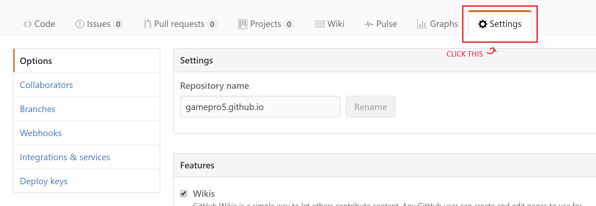
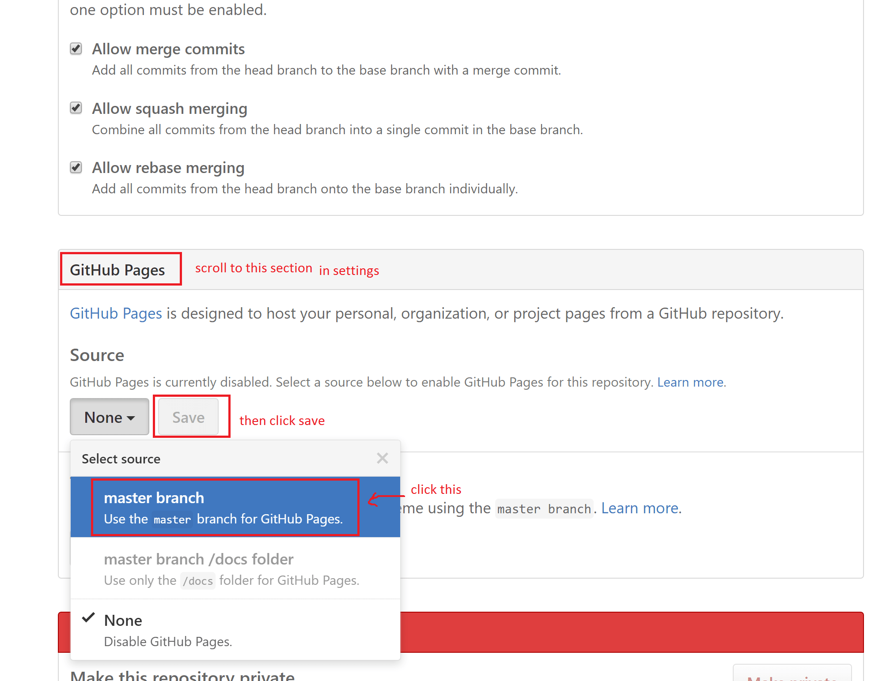

# how to get this as your own site
**step one** [fork this repository](https://www.youtube.com/watch?v=hEyOlAXedA8 "a video tutorial I made for someone else")

**step two**

**step three**

if that doesn't work, then you'll have to follow [github's directions](https://github.io "hopefully you're smart enough to understand all that")
